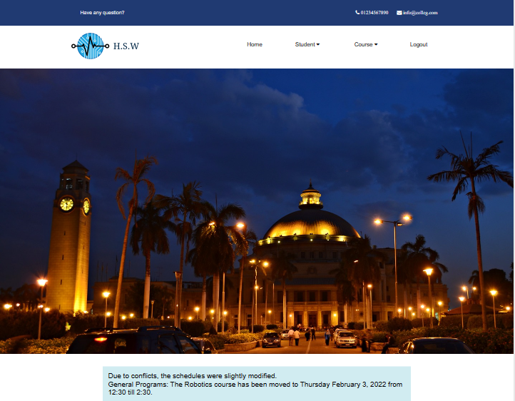
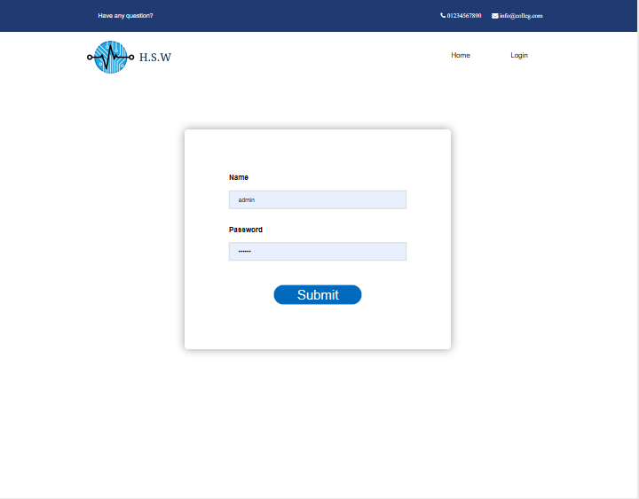

# StudentsAffairs_Website
Students Affairs Website via Django

### Stack: 
- Html 
- Css  
- JavaScript
- Django

# Feature
### - Login Authentication
### - Login Session
### - Search Filtering

# Pages
### - Home page
### - Login page
### - Add and View courses page
### - Add and View students registered page

# How it works
### Navigate to the directory that contains the manage.py file using 'cd project'.
### Run the command 'python manage.py runserver' to start the development server.
### Access it in your web browser by visiting http://127.0.0.1:8000/ or http://localhost:8000/.

# Login credentials:
### name = admin 
### pass = 123456

